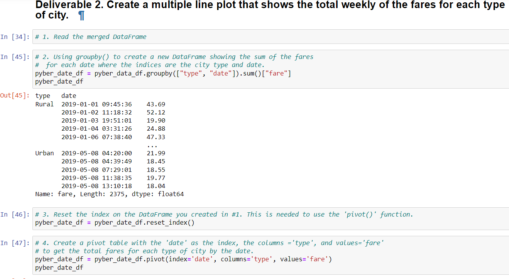
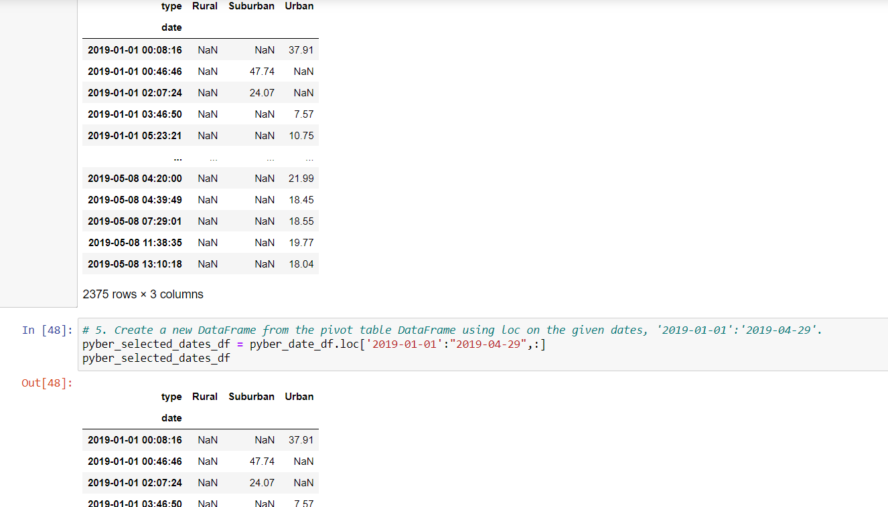
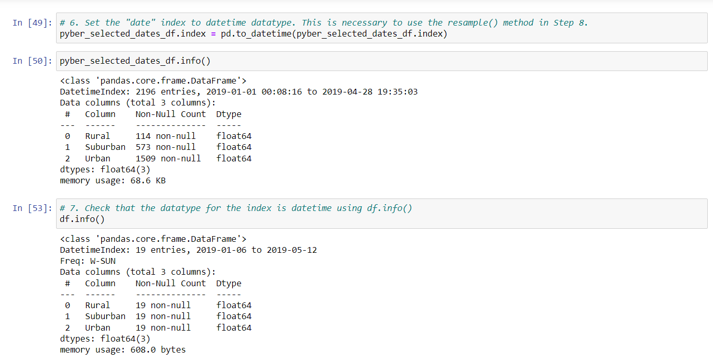
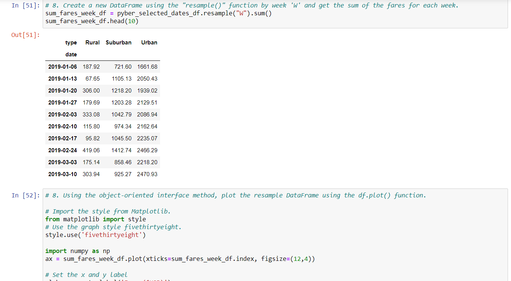

# PyBer_Analysis

## Overview of PyBer_Analysis

### Purpose
Our purpose will be to create a DataFrame with the rideshare data by city type and at the same time we will create a multi-line graph that will represent the total weekly fares for each city type.

## Results

**- Using images from the summary DataFrame and multiple-line chart, describe the differences in ride-sharing data among the different city types**
 Describe the differences in ride-sharing data among the different city types

  

  

  

  
 
 
 
  PyBer Analysis [PyBer_Challenge.ipynb](PyBer_Challenge.ipynb).

 

## Summary

**- Based on the results, provide three business recommendations to the CEO for addressing any disparities among the city typess**
    There is a statement summarizing three business recommendations to the CEO for addressing any disparities among the city types
 
